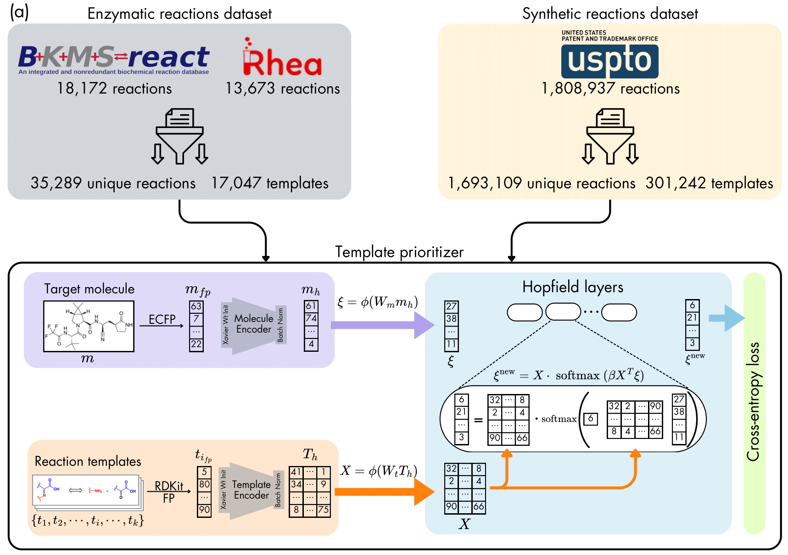
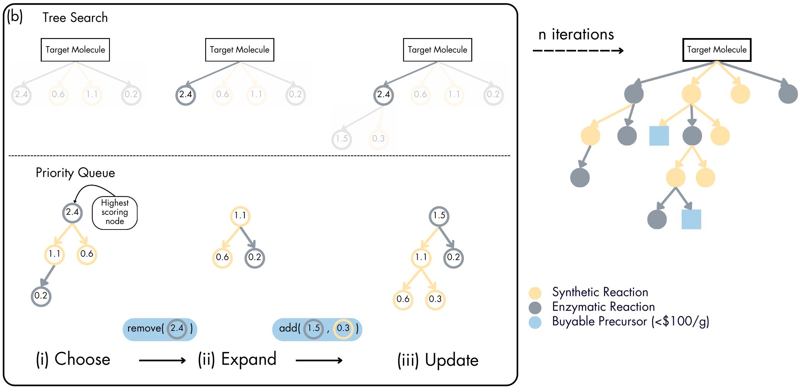

<div align="center">
<h2>A User-Tunable Machine Learning Framework for Step-Wise Synthesis Planning</h2>

[**Shivesh Prakash**](https://shivesh777.github.io/)<sup>1</sup> · [**Viki Kumar Prasad**](https://profiles.ucalgary.ca/viki-kumar-prasad)<sup>2,3,4</sup> · [**Hans-Arno Jacobsen**](https://www.eecg.toronto.edu/~jacobsen/)<sup>1,2</sup>

<sup>1</sup>Department of Computer Science, University of Toronto

<sup>2</sup>The Edward S. Rogers Sr. Department of Electrical & Computer Engineering, University of Toronto

<sup>3</sup>Data Sciences Institute, University of Toronto

<sup>4</sup>Current Affiliation: Department of Chemistry, University of Calgary

</div>

---

This repository contains the official implementation of **A User-Tunable Machine Learning Framework for Step-Wise Synthesis Planning**, soon to be available on Arxiv.

  


We introduce MHNpath, a machine learning-driven retrosynthetic tool designed for computer-aided synthesis planning. Leveraging modern Hopfield networks and novel comparative metrics, MHNpath efficiently prioritizes reaction templates, improving the scalability and accuracy of retrosynthetic predictions. The tool incorporates a tunable scoring system that allows users to prioritize pathways based on cost, reaction temperature, and toxicity, thereby facilitating the design of greener and cost-effective reaction routes. We demonstrate its effectiveness through case studies involving complex molecules from ChemByDesign, showcasing its ability to predict novel synthetic and enzymatic pathways. Furthermore, we benchmark MHNpath against existing frameworks, replicating experimentally validated "gold-standard" pathways from PaRoutes. Our case studies reveal that the tool can generate shorter, cheaper, moderate-temperature routes employing green solvents, as exemplified by compounds such as dronabinol, arformoterol, and lupinine.

---

### Getting Started

1. **Setup Environment**

   Make the project directory your current working directory (this is important):

   ```bash
   conda create -n "mhnpath" python=3.8
   conda activate mhnpath
   pip install -r requirements.txt
   ```
   To use the pricing feature, obtain your API keys from one or all of Mcule, Molport, and Chemspace, and add them to the `config.yaml` file. We highly recommend doing this for the best and most accurate results.

2. **Download Data and Models**

   Go to [Figshare Dataset](https://figshare.com/articles/dataset/Training_data_trained_models_and_other_required_files_for_A_User-Tunable_Machine_Learning_Framework_for_Step-Wise_Synthesis_Planning_/28673540), click on Download All, and save the zip file with the default name `28673540.zip`.

3. **Extract and Organize Files**

   Run the following command to unzip and move the data/models to the required locations:

   ```bash
   python extract.py
   ```

4. **Inference**

   To perform inference, run:
   ```bash
   python tree_search_global_greedy.py -product "compound" -n_enz 5 -n_syn 5 -max_depth 5 -json_pathway "tree.json" -device "cuda"
   ```

   Parameters:
   - `product` : SMILES string of the target product. (Required)
   - `n_enz` : Number of enzyme reaction rules to consider. (Optional, default: 3)
   - `n_syn` : Number of synthetic reaction rules to consider. (Optional, default: 3)
   - `max_depth` : Maximum depth for the tree search. (Optional, default: 3)
   - `json_pathway` : Filename for saving the resulting pathway tree in JSON format. (Optional, default: `"tree.json"`)
   - `device` : Device to run the model on; either `"cpu"` or `"cuda"`. (Optional, default: `"cpu"`)

5. Training

   To train using the same hyperparameters as in our experiments, run the following commands:

   ```bash
   python mhnreact/train.py --concat_rand_template_thresh 3 --exp_name enz_final --ssretroeval True --csv_path data/enz_mhn_shuffled.csv --save_model True --seed 0 --epoch 11 --dropout 0.01 --lr 1e-4 --hopf_beta 0.035 --hopf_association_activation 'Tanh' --norm_input False --temp_encoder_layers 2 --batch_size 32 > enz_final.txt
   ```
   ```bash
   python mhnreact/train.py --concat_rand_template_thresh 3 --exp_name syn1_final --ssretroeval True --csv_path data/syn_mhn_split_1.csv --save_model True --seed 0 --epoch 11 --dropout 0.01 --lr 1e-4 --hopf_beta 0.035 --hopf_association_activation 'Tanh' --norm_input False --temp_encoder_layers 2 --batch_size 32 > syn1_final.txt
   ```
   ```bash
   python mhnreact/train.py --concat_rand_template_thresh 3 --exp_name syn2_final --ssretroeval True --csv_path data/syn_mhn_split_2.csv --save_model True --seed 0 --epoch 11 --dropout 0.01 --lr 1e-4 --hopf_beta 0.035 --hopf_association_activation 'Tanh' --norm_input False --temp_encoder_layers 2 --batch_size 32 > syn2_final.txt
   ```
   ```bash
   python mhnreact/train.py --concat_rand_template_thresh 3 --exp_name syn3_final --ssretroeval True --csv_path data/syn_mhn_split_3.csv --save_model True --seed 0 --epoch 11 --dropout 0.01 --lr 1e-4 --hopf_beta 0.035 --hopf_association_activation 'Tanh' --norm_input False --temp_encoder_layers 2 --batch_size 32 > syn3_final.txt
   ```
   ```bash
   python mhnreact/train.py --concat_rand_template_thresh 3 --exp_name syn4_final --ssretroeval True --csv_path data/syn_mhn_split_4.csv --save_model True --seed 0 --epoch 11 --dropout 0.01 --lr 1e-4 --hopf_beta 0.035 --hopf_association_activation 'Tanh' --norm_input False --temp_encoder_layers 2 --batch_size 32 > syn4_final.txt
   ```
   ```bash
   python mhnreact/train.py --concat_rand_template_thresh 3 --exp_name syn5_final --ssretroeval True --csv_path data/syn_mhn_split_5.csv --save_model True --seed 0 --epoch 11 --dropout 0.01 --lr 1e-4 --hopf_beta 0.035 --hopf_association_activation 'Tanh' --norm_input False --temp_encoder_layers 2 --batch_size 32 > syn5_final.txt
   ```

### Credits

This code base is built on top of, and thanks to them for maintaining the repositories:

- [mhn-react](https://github.com/ml-jku/mhn-react)
